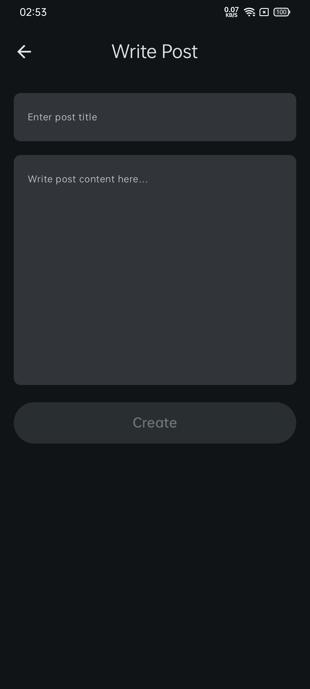

# OfflineFirstCRUD

A simple Android application created with [JSONPlaceholder](https://jsonplaceholder.typicode.com) for demonstrating CRUD
operations with offline-first functionality. The app leverages RoomDB for local storage and WorkManager for synchronizing data with the
JSONPlaceholder API.

## Table of Contents

- [Screenshots](#screenshots)
- [Features](#features)
- [Architecture](#architecture)
- [Technologies Used](#technologies-used)

## Screenshots

|                                          Posts List                                          |                                            Post Details                                            |                                        Create Details                                         |
|:--------------------------------------------------------------------------------------------:|:--------------------------------------------------------------------------------------------------:|:---------------------------------------------------------------------------------------------:|
| 
  
 |  
  
  | 
  
 |
|                                          Edit Post                                           |                                           Refresh Posts                                            |                                                                                               |
|  
  
  | 
  
 |                                                                                               |

## Features

- **Create (POST)**: Add new posts to the local database. If offline, posts are queued for synchronization when online.
- **Read (GET)**: Display a list of posts from the API if online or from the local database if offline.
- **Update (PUT)**: Edit posts locally first. Changes are synchronized with the API when online.
- **Delete (DELETE)**: Mark posts as deleted locally and sync deletions with the API when online.
- **Synchronization**: Automatically sync data between the local database and the JSONPlaceholder API using WorkManager.
- **Offline First**: Ensures a seamless user experience even without network connectivity.

## Architecture

This project follows Clean Architecture principles for scalability and maintainability. It is implemented using the MVVM (Model-View-ViewModel)
pattern. Key layers include:

1. **Presentation Layer**: Jetpack Compose for UI and ViewModels for state management.
2. **Domain Layer**: Use cases encapsulating business logic.
3. **Data Layer**: Repositories interacting with both RoomDB and the JSONPlaceholder API.

  

## Technologies Used

- **[MVVM Architecture](https://en.wikipedia.org/wiki/Model%E2%80%93view%E2%80%93viewmodel)**: Implements Model-View-ViewModel pattern for separation
  of concerns.
- **[Kotlin](https://kotlinlang.org/)**: Official programming language for Android development.
- **[Jetpack Compose](https://developer.android.com/jetpack/compose)**: Modern toolkit for building native UI.
- **[RoomDB](https://developer.android.com/training/data-storage/room)**: Local database for offline-first functionality.
- **[WorkManager](https://developer.android.com/topic/libraries/architecture/workmanager)**: For managing background synchronization tasks.
- **[Retrofit](https://square.github.io/retrofit/)**: A type-safe HTTP client for API communication.
- **[Kotlin Coroutines](https://developer.android.com/kotlin/coroutines)**: Asynchronous programming with structured concurrency.
- **[Material3 Design](https://m3.material.io/)**: UI/UX design framework.
